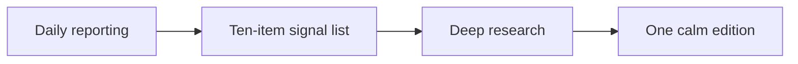

## What this is

Each edition begins with the ten developments that mattered in the preceding day, then spends its attention on the few connections worth carrying forward. It is designed to be read once, on a phone or e-reader, without a feed to manage.

## The editorial shape

### 1. Signal

Every item names the event, links to primary reporting where possible, and explains why it matters. The automation is asked to distinguish confirmed facts from interpretation.

### 2. Synthesis

The research pass looks for causal links and second-order effects across the day's stories. It should make uncertainty explicit rather than invent certainty.

### 3. Concepts when they help

Technical ideas can use scientific notation without sacrificing readability. For example, the usual softmax transformation is $p_i = \frac{e^{z_i}}{\sum_j e^{z_j}}$.

## Your point of view belongs here

Add editorial preferences in `prompts/preferences.md`. The generator includes that file in each research and writing pass, so the publication can develop a consistent lens over time.
