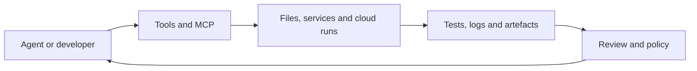

## The day in Software Engineering & Web Development

The strongest signal is not a new coding model but the steady professionalisation of coding agents. OpenHands 1.25.0 adds bulk model-profile creation, direct-prompt routing, agent personas, native Git integrations and configurable workspace discovery, making multi-model agent deployments more manageable. Claude Code 2.1.290 adds subagent identifiers, tool-call metadata, named-session attachment and logs, while tightening plugin validation and managed-settings safeguards. ([OpenHands 1.25.0](https://github.com/OpenHands/OpenHands/releases/tag/v1.25.0), [Claude Code 2.1.290](https://github.com/anthropics/claude-code/releases/tag/v2.1.290))

The surrounding tooling is moving in the same direction. Copilot CLI now lets developers choose local or cloud execution, preserves prompts through compaction and improves MCP recovery; Codex CLI fixes Windows environment loss for remote MCP servers; and Buildkite can fetch the current base branch before running diff-sensitive jobs. In web development, a Next.js canary stabilises access-control APIs and adds ESLint 10 support. The remaining releases are narrower but revealing: Gemini CLI is still iterating nightly, OpenHands is adding design guidance to agent skills, protoAgent is treating PDFs as inspectable artefacts, and Future AGI is improving simulation analytics. ([Copilot CLI 1.0.92](https://github.com/github/copilot-cli/releases/tag/v1.0.92), [Codex CLI 0.160.1](https://github.com/openai/codex/releases/tag/rust-v0.160.1), [Buildkite Agent 4.2.0](https://github.com/buildkite/agent/releases/tag/v4.2.0), [Next.js 16.4.0-canary.61](https://github.com/vercel/next.js/releases/tag/v16.4.0-canary.61))

## The deeper pattern

Today’s releases point to a shift from “AI that writes code” towards “software systems that supervise AI doing work”. The new control surfaces are operational: model selection, session identity, tool permissions, environment boundaries, logs and recovery behaviour. OpenHands’ router and profile changes let teams decide which model and persona should handle a task. Claude Code’s hook metadata lets an integration distinguish the main session from a subagent and inspect the tools used by an agent step. These are prerequisites for governance, debugging and cost control, not evidence that agents are independently reliable.

The MCP changes are especially instructive. Copilot CLI addresses credential renewal, stalled legacy connections, oversized requests and accidental exposure of ambient `GITHUB_TOKEN` values. Codex fixes the loss of `SYSTEMROOT`, `TEMP` and `TMP` when a Unix host launches a Windows remote MCP server. Those are mundane defects, but they expose a central engineering reality: agent capability is bounded by the reliability and security of the tool boundary around it. A model may produce a plausible plan, yet the workflow still fails if credentials expire, context is compacted incorrectly or the target operating system lacks its expected environment.

That makes observability part of the agent product rather than an afterthought. Claude Code’s named-session attach and log commands, plus hook-level identifiers, make execution more inspectable. Future AGI’s release improves cached serving and case handling in a simulation interface, while protoAgent’s PDF renderer makes generated documents directly reviewable, with safeguards for password-protected, oversized and suspicious files. These changes do not prove better agent outcomes. They do, however, reduce the cost of finding out what happened.

The CI and web-framework updates show the same pattern outside agent runtimes. Buildkite’s base-branch fetch option makes a merge comparison depend on the current target branch rather than stale checkout state, improving the conditions under which tests and automation make decisions. Next.js is stabilising `forbidden()` and `unauthorized()` while supporting ESLint 10, and its canary also streams bundle-analysis data as JSON Lines. The practical consequence is tighter feedback between application policy, code quality and build evidence. That matters more as agents generate larger volumes of changes: a faster authoring loop is useful only if the validation loop remains current and interpretable.

The common architecture can be expressed simply:

The important development is the strengthening of every arrow. Model routers and agent profiles shape the first step; MCP fixes and sandbox controls protect the second; cloud-run selection and workspace discovery govern the third; CI base-branch fetching and simulation analytics improve the fourth; design guidance, access-control APIs and hook metadata support the final review loop.

There is also a warning in the release cadence. Gemini CLI’s nightly build and Next.js’s canary are evidence of active development, not stable production recommendations. OpenHands Extensions’ design guidance may improve consistency for frontend work, but the release itself does not demonstrate that agents produce better interfaces. Likewise, a PDF preview makes an artefact easier to inspect; it does not establish that the underlying report is accurate. This is a day of infrastructure for trustworthy workflows, not a measured breakthrough in autonomous programming.

## What to watch next

1. Whether the new agent hooks and session controls produce usable third-party observability integrations. Look for documented examples or integrations that can trace a subagent’s tool calls, approvals and failures across a complete coding task.

2. Whether MCP reliability fixes translate into fewer failed long-running sessions. Watch for issue or release data from Copilot CLI, Codex and comparable tools showing reductions in credential, environment, timeout or context-related failures.

3. Whether Next.js promotes the access-control and ESLint changes from canary into a stable release without significant API or migration changes. That will indicate whether these workflow improvements are ready for ordinary production applications rather than early adopters.

## Editorial note

The main blind spot is outcome evidence. The supplied material is dominated by release notes, which reliably show what maintainers changed but rarely measure whether developers became faster, safer or more accurate. The edition therefore treats improved control, observability and failure handling as directional signals, not proof of better software delivery.
