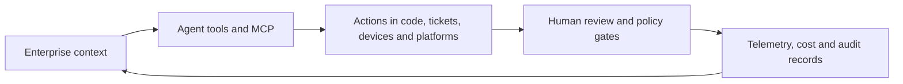

## The day in Software Engineering & Web Development

The strongest signal is that coding agents are moving out of the editor and into the systems that organise software work. Atlassian is tying Jira, Confluence, Bitbucket, Loom and its Teamwork Graph to agent sessions, code context, planning, review and measurement. Its expanded partnership with OpenAI will bring frontier models into Rovo and developer workflows, while Atlassian’s new Agentic Multiplayer Protocol (AMP) proposes identity, shared context and governed participation for agents working alongside people. These are vendor announcements, not proof of broad productivity gains, but they show where enterprise tooling is heading: agents becoming accountable participants in the software-delivery system rather than private assistants in a terminal. ([OpenAI](https://openai.com/index/atlassian-partnership/); [Atlassian AI-native SDLC update](https://www.atlassian.com/blog/company-news/team26-europe-ai-sdlc); [Atlassian AMP announcement](https://www.businesswire.com/news/home/20261007004190/en/Atlassian-Introduces-AMP-The-Agentic-Multiplayer-Protocol-to-Power-Human-AI-Collaboration))

The second signal is infrastructure around those agents. Silicon Labs is making its SDK, hardware documentation and connected devices available to Copilot, Cursor and Codex, extending agent-assisted development into embedded configuration and debugging. DoiT is pairing OpenAI deployment on AWS with cost attribution; OSERA is coordinating open-source vulnerability remediation among banks; and several companies are exposing governed enterprise data or business functions through MCP. The practical message is less about one breakthrough model than about the missing plumbing: context, permissions, observability, cost control, supply-chain assurance and interfaces that allow agents to act safely in production systems. ([Silicon Labs](https://www.prnewswire.com/news-releases/silicon-labs-expands-ai-developer-platform-to-simplify-iot-development-and-scale-edge-intelligence-302900358.html); [DoiT](https://www.prnewswire.com/news-releases/doit-partners-with-openai-to-help-enterprises-run-openai-models-on-aws-and-attribute-every-dollar-302900480.html); [OSERA](https://www.prnewswire.com/news-releases/major-banks-back-osera-to-deliver-industry-wide-remediation-standards-and-fixes-to-secure-open-source-software-302900065.html))

## The deeper pattern

The day’s developments fit a common architectural shift:

Traditional developer tools assume a human is the durable source of intent. An issue tracker records the request, an IDE edits the code, CI tests it and an operations system reports what happened. The emerging agentic stack is trying to make that loop legible to software agents. Atlassian’s Teamwork Graph is an example of the context layer: it connects work items, documentation, code and decisions, while newer features are designed to attach agent sessions and outputs to that record. Its own internal testing reports better answer quality and lower token use when agents have richer context, but those figures remain vendor-reported rather than independent evaluations. ([Atlassian AI-native SDLC update](https://www.atlassian.com/blog/company-news/team26-europe-ai-sdlc))

MCP is becoming a convenient boundary for this architecture. Market Logic’s DeepSights MCP exposes cited, customer-curated market knowledge to Copilot, ChatGPT, Claude and custom agents. CAEVES says its Context LAKE will expose data where it already resides, across public, private and sovereign clouds, while retaining existing access controls and traceability. Beyond Now is applying a similar idea to telecom software: products, partners, pricing, orders and services become available through APIs and MCP to people, systems and agents. ([Market Logic](https://www.prnewswire.com/news-releases/market-logics-deepsights-mcp-scales-market-insights-reach-and-business-impact-through-enterprise-wide-ai-workflows-302899946.html); [CAEVES](https://www.prnewswire.com/news-releases/caeves-introduces-context-lake-turning-enterprise-data-into-trusted-context-for-any-ai-assistant-via-mcp-302900040.html); [Beyond Now](https://www.prnewswire.com/news-releases/beyond-now-launches-agentic-platform-to-power-csps-growth-in-the-agentic-economy-302900215.html))

That creates a more important engineering problem than simply choosing a model: how should an agent be allowed to act? Atlassian’s AMP proposal addresses identity, ownership and visibility. Dfinitiv’s SmartCXP AI applies the same logic to customer-facing applications, offering versioned MCP servers, tools, guardrails, rollback and usage analytics for loyalty programmes operating across ChatGPT, Claude and other assistants. The notable design choice is to treat an assistant integration as a deployable application surface, with release management and runtime governance, rather than as a one-off prompt connection. The company’s claims describe product capabilities, not evidence that these systems are reliable in high-stakes use. ([Atlassian AMP announcement](https://www.businesswire.com/news/home/20261007004190/en/Atlassian-Introduces-AMP-The-Agentic-Multiplayer-Protocol-to-Power-Human-AI-Collaboration); [Dfinitiv](https://www.prnewswire.com/news-releases/dfinitiv-launches-smartcxp-ai-to-build-run-and-manage-loyalty-program-apps-across-chatgpt-claude-and-emerging-ai-assistants-302900436.html))

The operational consequences are already visible. DoiT’s partnership frames model spend as a software-observability problem: teams need to connect inference costs to a product, customer, feature or agent, not merely to a cloud invoice. Atlassian’s DX measurement work makes a parallel claim about engineering outcomes, attempting to connect agent activity with throughput, quality, friction and return on investment. This is a necessary correction to adoption metrics. The number of generated pull requests or agent sessions says little unless teams can establish whether changes are correct, maintainable, secure and cheaper than the process they replace. ([DoiT](https://www.prnewswire.com/news-releases/doit-partners-with-openai-to-help-enterprises-run-openai-models-on-aws-and-attribute-every-dollar-302900480.html); [Atlassian AI-native SDLC update](https://www.atlassian.com/blog/company-news/team26-europe-ai-sdlc))

Security is moving in the same direction. OSERA’s shared remediation model aims to reduce duplicated vulnerability work across financial institutions, with common patches and attestation for widely used Java projects. That is a supply-chain response to a world where organisations depend on the same open-source components and increasingly automate changes at scale. But the crucial test is whether the standard produces timely, independently verifiable fixes, not simply whether a coalition has been announced. ([OSERA](https://www.prnewswire.com/news-releases/major-banks-back-osera-to-deliver-industry-wide-remediation-standards-and-fixes-to-secure-open-source-software-302900065.html))

Finally, Silicon Labs shows the boundary of “software development” widening. Its public-beta SDK gives general-purpose coding assistants structured access to embedded SDKs, tools, documentation and hardware. If this works, agents will increasingly operate across code, configuration, devices and test environments. That could remove friction from specialised development, but it also raises the cost of a wrong assumption: an incorrect web refactor is reversible; a bad hardware configuration or firmware change may require physical recovery and deeper validation. ([Silicon Labs](https://www.prnewswire.com/news-releases/silicon-labs-expands-ai-developer-platform-to-simplify-iot-development-and-scale-edge-intelligence-302900358.html))

## What to watch next

1. **Whether agent identity becomes enforceable rather than descriptive.** Watch for Atlassian or comparable platforms to publish concrete permission models, audit records, revocation controls and integrations with identity providers. A named agent that cannot be constrained or independently audited is only a label.

2. **Whether MCP integrations produce measurable production reliability.** Look for public data on permission failures, tool-call errors, rollback rates, citation accuracy and incident impact across the new enterprise context services. General availability alone will not establish that governed context is trustworthy.

3. **Whether AI cost attribution changes engineering decisions.** Watch for teams to report reductions in cost per successful task, not merely more detailed dashboards. The meaningful test is whether attribution leads to model selection, routing, caching or architecture changes that improve unit economics without degrading quality.

## Editorial note

This edition relies heavily on vendor and partner announcements, several distributed through press-release services. The main blind spot is independent validation: reported velocity improvements, answer-quality gains, cost attribution accuracy and security outcomes may not survive testing outside the announcing organisations. The qualifying window used here is 6 October 2026 14:00 UTC to 7 October 2026 14:00 UTC; later commentary and roadmap claims have been treated as context rather than as new evidence.
